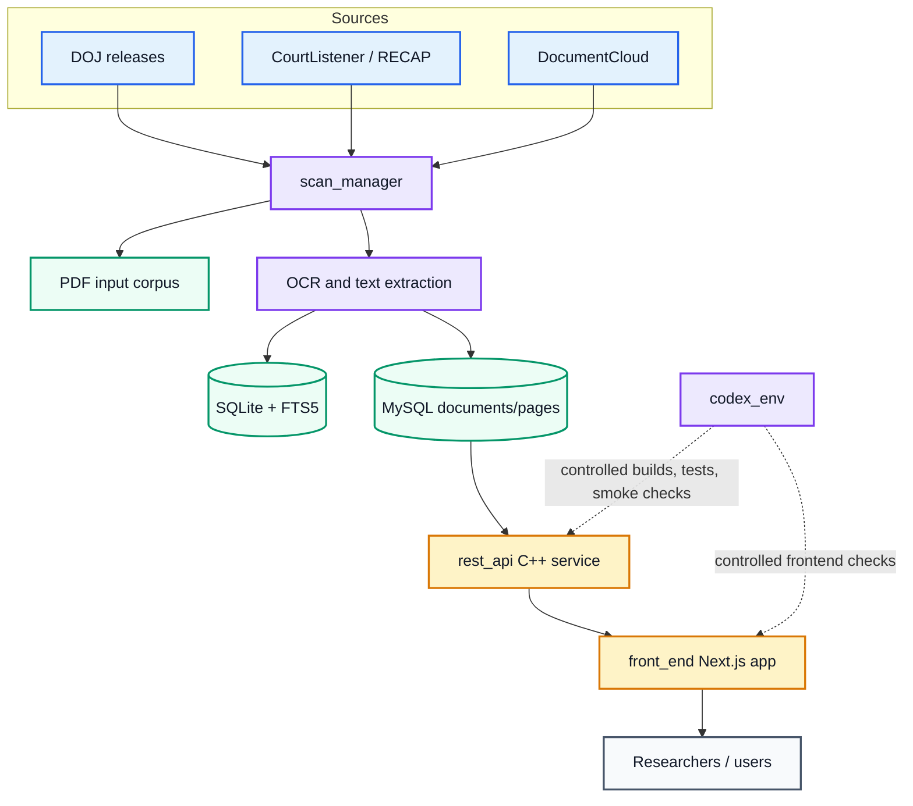

# EPS - Epstein Paper System

EPS is a document research platform for collecting, indexing, searching, and viewing public court documents and public government releases related to the Jeffrey Epstein court case.

The repository is split into focused components:

- `scan_manager/`: document collection, OCR, ingestion, and full-text indexing pipeline.
- `rest_api/`: C++ REST API exposing indexed court documents from MySQL.
- `front_end/`: Next.js web UI and document visualizer.
- `codex_env/`: controlled Codex/LLM development environment with a whitelisted host command bridge.

For detailed setup and operations, start with the component READMEs:

- [Frontend README](./front_end/README.md)
- [REST API README](./rest_api/README.md)
- [Scan Manager README](./scan_manager/README.md)
- [Codex Environment README](./codex_env/README.md)

## High-Level Architecture



## Component Overview

### `scan_manager/`

[scan_manager](./scan_manager/README.md) handles the document acquisition and ingestion pipeline. It can crawl supported public sources, run OCR with Tesseract, store extracted text, and provide search over an SQLite FTS5 index. It also contains a legacy token extraction pipeline for CSV/JSON workflows.

Typical responsibilities:

- Crawl DOJ, CourtListener, and DocumentCloud sources.
- Store PDFs under `scan_manager/data/input/`.
- OCR documents into structured document/page text.
- Maintain SQLite full-text search data.
- Prepare document/page data for downstream API storage.

### `rest_api/`

[rest_api](./rest_api/README.md) is the C++ service layer. It uses Crow and MySQL-backed repository classes to expose court documents and page text over HTTP.

Current document endpoints used by the frontend:

```txt
GET /courtdocuments?limit=&offset=
GET /courtdocuments/<id>
GET /courtdocuments/<id>/pages
GET /courtdocuments/search?q=...&limit=&offset=
```

The API stores and returns document metadata, full text, page-level text, and full-text search snippets.

### `front_end/`

[front_end](./front_end/README.md) is the Next.js web interface. It provides the EPS landing page, legal pages, public metadata, `robots.txt`, `llms.txt`, and the document visualizer at `/services/search-engine`.

The search page lets users:

- Search court documents.
- Browse paginated results.
- Inspect snippets and relevance scores.
- Open documents.
- Read full text or page-level OCR text.
- View document metadata.

The frontend reads the REST API base URL from `NEXT_PUBLIC_REST_API_URL`. It also exposes `/api/runtime-config` so containerized deployments can provide that value at runtime.

### `codex_env/`

[codex_env](./codex_env/README.md) provides a controlled development environment for Codex or similar LLM agents. It uses a capability-gated host command bridge: Codex runs inside a Docker container and can execute only whitelisted host operations through a forced SSH command, a dedicated `codex-runner` user, and sudoers-limited `codex-devctl` commands.

Typical allowed operations include:

- REST API builds and tests.
- Frontend typecheck/build/test commands.
- Docker container status and logs.
- Document API smoke checks.

## Quick Start Paths

Use the component README for the workflow you need.

### Run The Frontend

```bash
cd front_end
cp .env.example .env.local
npm install
npm run dev
```

Set `NEXT_PUBLIC_REST_API_URL` in `front_end/.env.local` so the search page can reach the REST API.

Details: [front_end/README.md](./front_end/README.md)

### Work On The REST API

```bash
cd rest_api
source bash_scripts/helper_script.sh
rest_api_build_dev
rest_api_run_dev
```

Details: [rest_api/README.md](./rest_api/README.md)

### Run The Scan Pipeline

```bash
cd scan_manager
python -m venv .venv
source .venv/bin/activate
pip install pyyaml pdf2image pytesseract pillow beautifulsoup4 rapidfuzz requests playwright
playwright install chromium
```

Details: [scan_manager/README.md](./scan_manager/README.md)

### Use The Codex Command Bridge

```bash
cd codex_env
source bash_script/helper_script.sh
codex_env_build_img
codex_env_login
```

Bridge setup and command reference: [codex_env/README.md](./codex_env/README.md)

## Local Development Topology

Common container names and ports used by the current helper scripts:

| Component | Container | Port |
| --- | --- | --- |
| Frontend | `cont_eps_front` | `3000` in container, often `8084` on host |
| REST API | `cont_llvm_mysql_crow` | `3004` |
| MySQL | `mysqlserver` | `3306` |
| Docker network | `sqlRest` | n/a |

When making requests from another container on the same Docker network, Docker DNS names such as `cont_llvm_mysql_crow:3004` can be used. When making requests from a host browser, use the host-published address, such as `http://localhost:3004`.

## Public Agent Instructions

The frontend publishes an LLM-oriented API guide at:

```txt
/llms.txt
```

That file describes how agents should call the REST API, including endpoint shapes, response fields, pagination, search snippets, and OCR/legal accuracy caveats.

## Environment Notes

Important frontend variables:

```txt
NEXT_PUBLIC_REST_API_URL=http://localhost:3004
NEXT_PUBLIC_SITE_URL=http://localhost:3000
```

`NEXT_PUBLIC_REST_API_URL` should point to the REST API origin reachable by the browser or frontend runtime. `NEXT_PUBLIC_SITE_URL` is used for canonical URLs, sitemap generation, robots output, and social metadata.

REST API and database credentials are managed by the REST API helper scripts and container environment. See [rest_api/README.md](./rest_api/README.md) for details.

## Repository Layout

```txt
.
├── codex_env/      Controlled Codex/LLM development environment
├── front_end/      Next.js frontend and document visualizer
├── rest_api/       C++ Crow REST API and MySQL repository layer
├── scan_manager/   Crawling, OCR, ingestion, and search pipeline
└── README.md       Top-level project overview
```

## Verification Commands

Common checks are component-specific:

```bash
# Frontend
cd front_end
npm run build

# REST API
cd rest_api
# See rest_api/README.md and bash_scripts/helper_script.sh

# Codex bridge, from inside the Codex container
codex_env/bin/devctl front-typecheck
codex_env/bin/devctl front-build
codex_env/bin/devctl test-doc-search cont_llvm_mysql_crow:3004 epstein 5 0
```

## Data And Accuracy Caveat

EPS works with public records and automated extraction. OCR, parsing, metadata extraction, and search snippets can contain errors or omissions. Treat EPS as a research aid; verify legal citations and factual claims against original source documents.
