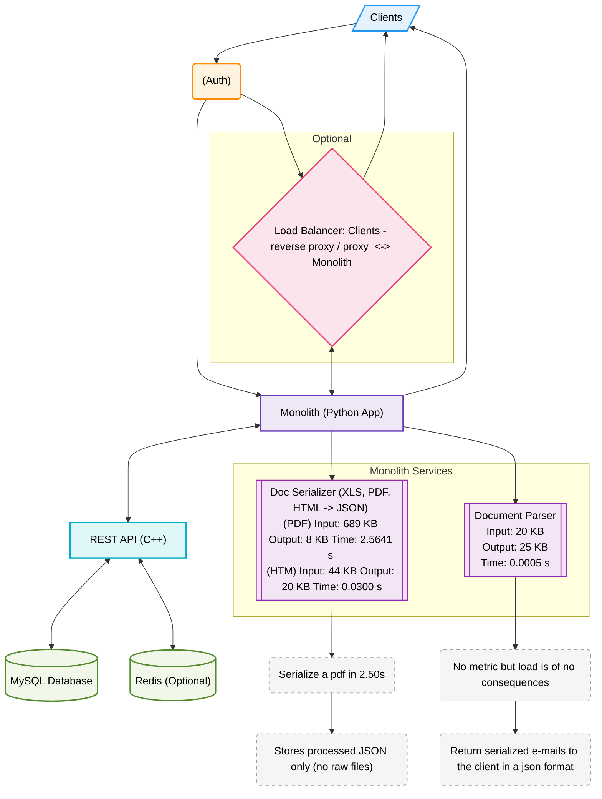

# eps

### Data Highlights

| Component            | Input  | Output | Time     |
| -------------------- | ------ | ------ | -------- |
| Doc Serializer (PDF) | 689 KB | 8 KB   | 2.5641 s |
| Doc Serializer (HTM) | 44 KB  | 20 KB  | 0.0300 s |
| Document Parser      | 20 KB  | 25 KB  | 0.0005 s |

### Color Roles

| Role          | Background     | Border      |
| ------------- | -------------- | ----------- |
| Clients       | Light Blue     | Blue        |
| Auth          | Light Orange   | Deep Orange |
| Monolith      | Light Purple   | Indigo      |
| REST API      | Aqua           | Cyan        |
| Databases     | Light Green    | Green       |
| Proxy/LB      | Pink           | Rose        |
| Internal Svcs | Light Lavender | Purple      |
| Metrics       | Light Gray     | Dashed Gray |

### Custom Shapes Legend

| Shape           | Component Type             |
| --------------- | -------------------------- |
| `rect`          | General Services / App     |
| `cylinder`      | Databases (MySQL, Redis)   |
| `parallelogram` | Client Input/Output        |
| `hexagon`       | Load Balancer / Proxy      |
| `roundrect`     | Auth / Identity            |
| `subroutine`    | Internal Monolith Services |

* **`/"..."`** → Parallelogram (Client)
* **`[...]`** → Rectangle (Monolith/API)
* **`[(...)]`** → Cylinder (Database)
* **`[[...]]`** → Subroutine (Internal service)
* **`{{...}}`** → Hexagon (Proxy/Load Balancer)
* **`(...)`** → Roundrect (Auth, metrics)

***
