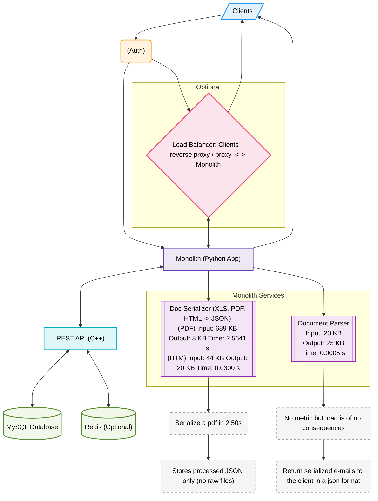

# Scan_manager



### Data Highlights

| Component            | Input  | Output | Time     |
| -------------------- | ------ | ------ | -------- |
| Doc Serializer (PDF) | 689 KB | 8 KB   | 2.5641 s |
| Doc Serializer (HTM) | 44 KB  | 20 KB  | 0.0300 s |
| Document Parser      | 20 KB  | 25 KB  | 0.0005 s |


### Color Roles

| Role          | Background     | Border      |
| ------------- | -------------- | ----------- |
| Clients       | Light Blue     | Blue        |
| Auth          | Light Orange   | Deep Orange |
| Monolith      | Light Purple   | Indigo      |
| REST API      | Aqua           | Cyan        |
| Databases     | Light Green    | Green       |
| Proxy/LB      | Pink           | Rose        |
| Internal Svcs | Light Lavender | Purple      |
| Metrics       | Light Gray     | Dashed Gray |


### Custom Shapes Legend

| Shape           | Component Type             |
| --------------- | -------------------------- |
| `rect`          | General Services / App     |
| `cylinder`      | Databases (MySQL, Redis)   |
| `parallelogram` | Client Input/Output        |
| `hexagon`       | Load Balancer / Proxy      |
| `roundrect`     | Auth / Identity            |
| `subroutine`    | Internal Monolith Services |

* **`/"..."`** → Parallelogram (Client)
* **`[...]`** → Rectangle (Monolith/API)
* **`[(...)]`** → Cylinder (Database)
* **`[[...]]`** → Subroutine (Internal service)
* **`{{...}}`** → Hexagon (Proxy/Load Balancer)
* **`(...)`** → Roundrect (Auth, metrics)


***

# Scan_manager
Small toolkit to turn messy business docs into structured data and back again.
It can OCR PDFs/HTML → JSON, extract fields via KMP/regex + YAML and talk to a REST backend.

## Description

**What it does**

* Convert **PDF/HTML → JSON** with OCR (Tesseract) — one page, one text block.
* Find fields by **tokens** (KMP or regex) driven by a **YAML config**.
* Minimal **REST client** for simple CRUD-ish backends.

## Installation

### Requirements

* **Python 3.10+**
* **System deps**

  * Tesseract OCR (Prerequisites at: https://pypi.org/project/pytesseract/)


### System packages (examples)

* Ubuntu/Debian:

  ```bash
  sudo apt-get update
  sudo apt-get install tesseract-ocr poppler-utils
  ```

### Python packages

```bash
python -m venv .venv && source .venv/bin/activate  # on Windows: .venv\Scripts\activate
pip install -r requirements.txt
```

## Usage

### 1) PDF/HTML → JSON (OCR)

```python
from pathlib import Path
from core.json_converter import json_converter

converter = json_converter(Path("./input"), Path("./output"))
converter.process_docs()  # writes one JSON per input file
```

### 2) Token extraction (YAML-driven KMP/regex)

`config/doc_template.yaml` (example):

```yaml
documents:
  invoice:
    match: ".*invoice.*\\.json$"
    tokens:
      - label: total_eur
        method: regex
        pattern: "Total\\s*:?\\s*([\\d.,]+)\\s*(?:EUR|€)"
        group: 1
      - label: order_number
        method: kmp
        pattern: "Numéro de la commande"
        extract_after: 30
```

Run:

```python
from core.token_finder import load_token_config, token_finder

token_config = load_token_config("./config/doc_template.yaml")
tf = token_finder("./output", "./updated", token_config)
tf.process_docs()  # writes enriched JSON with page["pos"] and page["values"]
```


### 3) Minimal REST client

```python
from core.rest_client import RestApiClient

api = RestApiClient("127.0.0.1:3004")
print(api.read_all("users"))
print(api.create_entity("users", {"name": "Alice"}))
```

## Support

* Open an issue in the repository (preferred).
* Or reach out via email: **[lorris.belus@cs-soprasteria.com](mailto:lorris.belus@cs-soprasteria.com)**.


```

## Authors and acknowledgment

* **Author and Maintainer:** *Lorris BELUS*

* Thanks to open-source projects: Tesseract, Poppler, pdf2image, BeautifulSoup.

