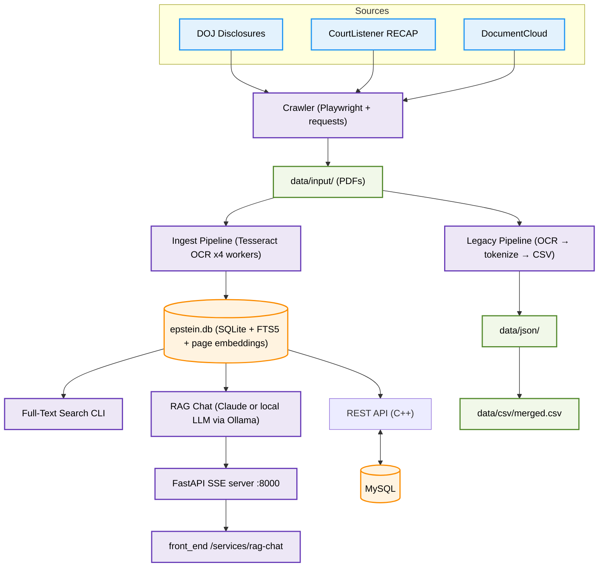
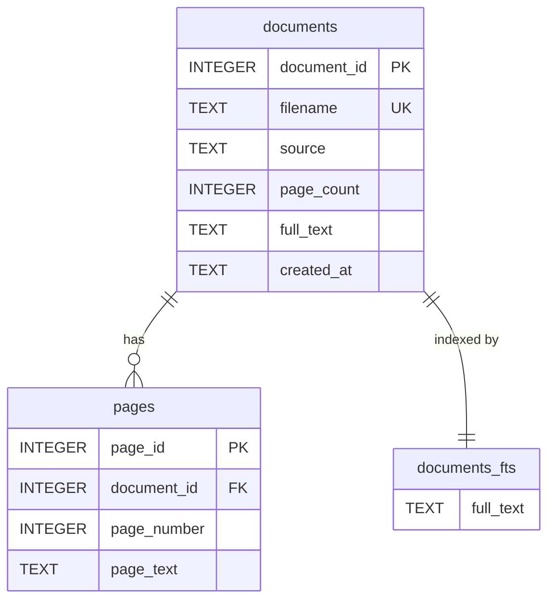

# EPS — Epstein Paper System

Document research pipeline for collecting, OCR'ing, and searching public court filings and government releases related to the Jeffrey Epstein and Ghislaine Maxwell cases.



---

## Quick Start

```bash
cd scan_manager
python -m venv .venv
source .venv/bin/activate
pip install -r requirements.txt
playwright install chromium
```

For the RAG chat, one of:
- **Open-source backend** (default): [Ollama](https://ollama.com) — `brew install ollama`, then `ollama pull qwen3:4b`. Free, fully local, no API key.
- **Claude backend** (opt in with `RAG_PROVIDER=anthropic`): export `ANTHROPIC_API_KEY`

For semantic search (optional): `ollama pull nomic-embed-text`

**System dependencies** (macOS):
```bash
brew install tesseract poppler
```

**Ubuntu/Debian:**
```bash
sudo apt-get install tesseract-ocr poppler-utils
```

---

## Usage

### 1. Crawl documents

```bash
python -m src.web.crawler                          # All sources
python -m src.web.crawler --source doj             # DOJ only
python -m src.web.crawler --source courtlistener   # CourtListener only
python -m src.web.crawler --source documentcloud   # DocumentCloud only
python -m src.web.crawler --headless false          # Show browser
python -m src.web.crawler --reset                   # Clear progress, fresh start
```

The crawler searches for documents related to subjects defined in `config/search_subjects.yaml` — Epstein, Maxwell, and associated individuals from public court records.

### 2. Ingest PDFs into database

```bash
python src/main.py --mode ingest                   # OCR all PDFs → SQLite (parallel)
python src/main.py --mode ingest --workers 2       # Limit workers (default: 4)
```

Parallel OCR with Tesseract. Resumable — re-runs skip already-ingested files.

### 3. Search

```bash
python src/main.py --mode search --query "grand jury"
python src/main.py --mode search --query "flight logs" --limit 50
```

Full-text search with FTS5 snippet highlighting.

### 4. Conversational RAG chat

An LLM answers questions about the corpus by driving retrieval itself: it
searches the index, locates and reads the relevant pages, and answers with
`(filename, p. N)` citations. Conversation history is kept, so follow-up
questions work.

```bash
python src/main.py --mode chat                          # CLI REPL (local Ollama, default)
RAG_PROVIDER=anthropic python src/main.py --mode chat   # paid Claude backend (needs ANTHROPIC_API_KEY)

# Web UI: start the SSE API, then the front_end dev server
uvicorn --app-dir src api.rag_server:app --port 8000
# cd ../front_end && npm run dev  →  http://localhost:3000/services/rag-chat
```

**Retrieval tools available to the model:** `search_documents` (FTS5 keyword),
`semantic_search` (vector similarity — see below), `find_pages` (locate a term
inside one document), `read_pages` (full OCR text of specific pages).

**Semantic index** (optional but recommended — recall for paraphrased/conceptual
queries that keyword search misses):

```bash
OLLAMA_CONTEXT_LENGTH=16384 ollama serve    # in another terminal
python src/main.py --mode embed             # one-time, resumable; ~1 hr for 110k pages
```

Embeds every substantial page with `nomic-embed-text` into a `page_embeddings`
table (~330 MB). The chat degrades gracefully without it. Note: query embedding
goes through Ollama, so `semantic_search` needs Ollama running even on the
Claude backend.

**Configuration (env vars):**

| Variable | Default | Purpose |
|----------|---------|---------|
| `RAG_PROVIDER` | `openai` | `openai` (any OpenAI-compatible server: Ollama, vLLM, LM Studio) or `anthropic` (paid Claude) |
| `RAG_MODEL` | `qwen3:4b` / `claude-opus-4-8` | Model ID (default depends on provider) |
| `RAG_BASE_URL` | `http://localhost:11434/v1` | OpenAI-compatible server URL (`openai` provider) |
| `RAG_API_KEY` | `ollama` | API key for that server (local servers ignore it) |
| `RAG_REASONING` | `none` | Reasoning effort for open models (`none`/`low`/`medium`/`high`). Hidden reasoning dominates local latency — `none` is ~12x faster on qwen3:8b |
| `RAG_FORCE_SEARCH` | `1` | Client-enforced search-before-answer (small models otherwise fabricate citations) |
| `RAG_TEMPERATURE` | `0.2` | Sampling temperature (`openai` provider); low = reliable tool calling |
| `RAG_EMBED_MODEL` | `nomic-embed-text` | Embedding model for the semantic index |
| `RAG_EMBED_URL` | `http://localhost:11434` | Ollama URL for embeddings |

**RAG API endpoints** (`src/api/rag_server.py`, port 8000):

```
POST   /rag/chat              {"message": "...", "session_id": "..."}  → SSE stream
GET    /rag/health            corpus size + active provider/model
DELETE /rag/session/{id}      drop a conversation
```

The SSE stream emits `{"type": "session"|"text"|"tool"|"done"|"error", ...}`
events. Sessions are in-memory (lost on restart) and the API has no auth — put
it behind a reverse proxy / auth layer before exposing it publicly.

### 5. Docker deployment (RAG API + Ollama)

The whole free/open-source RAG stack runs from the repo-root `docker-compose.yml`:
an Ollama container, a one-shot model pull, and the RAG API — no host Python,
Ollama, or manual model pulls required.

```bash
# from the repo root
docker compose up --build            # start Ollama, pull models, run the API
curl localhost:8000/rag/health       # {"status":"ok", "provider":"openai", ...}
```

What it does:
- **`ollama`** — serves the models; they persist on the `ollama-models` volume.
- **`ollama-pull`** — pulls `qwen3:4b` + `nomic-embed-text`, then exits; the API
  waits for it (`service_completed_successfully`).
- **`rag-api`** — the FastAPI server on port 8000, reaching Ollama by service name.

The corpus is provided by the `./scan_manager/data` mount. On a dev host that
reuses your locally-built `epstein.db` (with embeddings); on a fresh host the
mount holds only the tracked `epstein.db.gz`, which the entrypoint decompresses
once. Keyword search works immediately; for semantic search either mount a DB
that already has the `page_embeddings` table or set `RAG_BUILD_EMBEDDINGS=1`
(builds the index on first start — needs Ollama, ~1h for the full corpus).

Override models/origins with a `.env` beside the compose file:

```bash
RAG_MODEL=llama3.1:8b
RAG_CORS_ORIGINS=https://eps.example.com
RAG_BUILD_EMBEDDINGS=0
```

Point a front-end at the API with `NEXT_PUBLIC_RAG_API_URL=http://<host>:8000`
and add that origin to `RAG_CORS_ORIGINS`.

> **Note (macOS):** the Ollama *container* runs CPU-only under Docker Desktop —
> fine for a Linux server (and GPU-capable there), but slow on a Mac. For local
> dev on a Mac, prefer native `ollama serve` (uses the Apple GPU) with the API
> run directly, as in section 4.

### 6. Legacy pipeline (token extraction)

```bash
python src/main.py --mode scan           # Full: OCR → tokenize → CSV
python src/main.py --mode scan_exclude   # OCR only files NOT in CSV
python src/main.py --mode scan_include   # OCR only files already in CSV
python src/main.py --mode round_trip     # Re-import CSV corrections into JSON
```

---

## Database Schema

### SQLite (`data/epstein.db`)

The ingest pipeline stores OCR'd text in SQLite with FTS5 full-text search.

#### `documents`

| Column | Type | Description |
|--------|------|-------------|
| `document_id` | INTEGER | Primary key, auto-increment |
| `filename` | TEXT | Unique filename from `data/input/` |
| `source` | TEXT | `cl` (CourtListener), `dc` (DocumentCloud), or `doj` |
| `page_count` | INTEGER | Number of pages in the PDF |
| `full_text` | TEXT | All pages concatenated (OCR output) |
| `created_at` | TEXT | Timestamp of ingestion |

#### `pages`

| Column | Type | Description |
|--------|------|-------------|
| `page_id` | INTEGER | Primary key, auto-increment |
| `document_id` | INTEGER | FK → `documents.document_id` |
| `page_number` | INTEGER | 1-indexed page number |
| `page_text` | TEXT | OCR text for this page |

#### `documents_fts` (FTS5 virtual table)

Full-text search index over `documents.full_text`. Auto-synced via `AFTER INSERT/UPDATE/DELETE` triggers on the `documents` table.

**Search example (raw SQL):**
```sql
SELECT d.filename, d.source, d.page_count,
       snippet(documents_fts, 0, '>>>', '<<<', '...', 32) as snippet
FROM documents_fts f
JOIN documents d ON d.document_id = f.rowid
WHERE documents_fts MATCH 'Maxwell AND deposition'
ORDER BY rank
LIMIT 20;
```

#### `page_embeddings` (semantic index, built by `--mode embed`)

| Column | Type | Description |
|--------|------|-------------|
| `page_id` | INTEGER | PK, FK → `pages.page_id` |
| `embedding` | BLOB | L2-normalized float32 vector (768-dim, `nomic-embed-text`) |

Searched by brute-force cosine similarity in memory (`core/embeddings.py`) —
~110k vectors is tens of milliseconds, no vector-DB dependency. Pages under
50 chars (blank/garbage OCR) are skipped.

#### Indexes

| Index | Table | Column(s) |
|-------|-------|-----------|
| `idx_pages_document` | `pages` | `document_id` |
| `idx_documents_source` | `documents` | `source` |

#### ER Diagram



---

## Data Sources

| Source | Method | What it finds |
|--------|--------|---------------|
| **DOJ** | Playwright tree walk of `justice.gov/epstein/doj-disclosures` | Data sets, court records, FOIA releases, BOP footage, Maxwell proffer |
| **CourtListener** | REST API search per subject (`/api/rest/v4/search/`) | RECAP archive of federal court filings (SDNY, S.D. Fla, 2nd Circuit, etc.) |
| **DocumentCloud** | REST API search per subject | Public FOIA releases, indictments, depositions, interviews |

### Search Subjects (`config/search_subjects.yaml`)

All names sourced from unsealed federal court filings, flight logs, and DOJ prosecution records.

| Category | Examples |
|----------|---------|
| Primary | Jeffrey Epstein, Ghislaine Maxwell |
| Politicians | Bill Clinton, Donald Trump, Prince Andrew, Bill Richardson, George Mitchell, Alexander Acosta |
| Legal | Alan Dershowitz, Kenneth Starr |
| Business | Les Wexner, Leon Black, Glenn Dubin, Jes Staley |
| Entertainment | Jean-Luc Brunel, Naomi Campbell, Kevin Spacey |
| Inner circle | Sarah Kellen, Nadia Marcinkova, Lesley Groff |
| Victims (public) | Virginia Giuffre, Courtney Wild, Annie Farmer |
| Key queries | flight logs, black book, Little St James, Zorro Ranch |

---

## File Naming Conventions

Files in `data/input/` are prefixed by source:

| Prefix | Source | Example |
|--------|--------|---------|
| `cl_` | CourtListener | `cl_gov.uscourts.flsd.590436.1.0.pdf` |
| `dc_` | DocumentCloud | `dc_Ghislaine-Maxwell-Indictment.pdf` |
| (none) | DOJ | `EFTA02732399.pdf` |

---

## Directory Structure

```
scan_manager/
├── config/
│   ├── search_subjects.yaml    # Crawler search subjects
│   └── doc_template.yaml       # Token patterns (legacy pipeline)
├── data/
│   ├── input/                  # Downloaded PDFs
│   ├── output/                 # Raw OCR JSON (legacy)
│   ├── json/                   # Enriched JSON (legacy)
│   ├── csv/                    # Merged CSV (legacy)
│   ├── epstein.db              # SQLite + FTS5 database
│   ├── crawl_seen.txt          # Crawler: visited pages
│   └── crawl_pdfs.txt          # Crawler: downloaded URLs
├── src/
│   ├── core/
│   │   ├── database.py         # SQLite schema, insert, search
│   │   ├── ingest.py           # Parallel OCR → DB pipeline
│   │   ├── search.py           # CLI search interface
│   │   ├── doc_serializer.py   # OCR engine (legacy)
│   │   ├── token_finder.py     # Field extraction (legacy)
│   │   └── round_trip.py       # CSV↔JSON sync (legacy)
│   ├── web/
│   │   ├── crawler.py          # Multi-source document crawler
│   │   └── queries.py          # Search query generator
│   ├── plugin/
│   │   └── scan_manager.py     # Legacy pipeline orchestration
│   └── main.py                 # CLI entry point
```

---

## Testing

```bash
.venv/bin/pytest            # 44 tests, ~1.5s, fully offline
```

No Ollama, Anthropic key, or network needed: database/retrieval tools run
against a small fixture corpus (`tests/conftest.py`), the OpenAI agent loop
runs against a fake streaming client, embeddings are faked deterministically,
and the FastAPI server is tested with the turn generator stubbed.

| File | Covers |
|------|--------|
| `tests/test_database.py` | Schema, ingest bookkeeping, FTS5 search + trigger sync |
| `tests/test_rag_tools.py` | The four retrieval tools, tool dispatch/error paths, `<think>` filter |
| `tests/test_openai_loop.py` | Streamed tool-call assembly, forced search, discard-and-nudge retry for ungrounded answers |
| `tests/test_embeddings.py` | Semantic index build (resumable), cosine ranking, graceful empty-index fallback |
| `tests/test_rag_server.py` | SSE event stream, session continuity, busy-lock 409, error rollback |

---

## Performance

| Component | Input | Output | Time |
|-----------|-------|--------|------|
| Doc Serializer (PDF) | 689 KB | 8 KB JSON | ~2.5 s |
| Doc Serializer (HTM) | 44 KB | 20 KB JSON | ~0.03 s |
| Ingest (parallel, 4 workers) | 1,166 PDFs / 1.9 GB | SQLite DB | varies by doc size |

---

## REST API (C++)

Separate service in `rest_api/`. See [rest_api/README.md](../rest_api/) or the project CLAUDE.md for full docs.

```bash
cd rest_api
source bash_scripts/helper_script.sh
rest_api_build_dev && rest_api_run_dev
```

Default port: **3004**

```
GET    /exampleusers?limit=10&offset=0
GET    /exampleusers/:id
POST   /exampleusers   {"name":"...","email":"..."}
PUT    /exampleusers/:id
DELETE /exampleusers/:id
```
